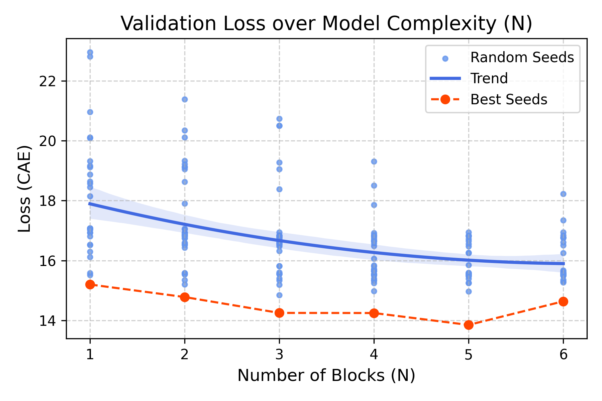
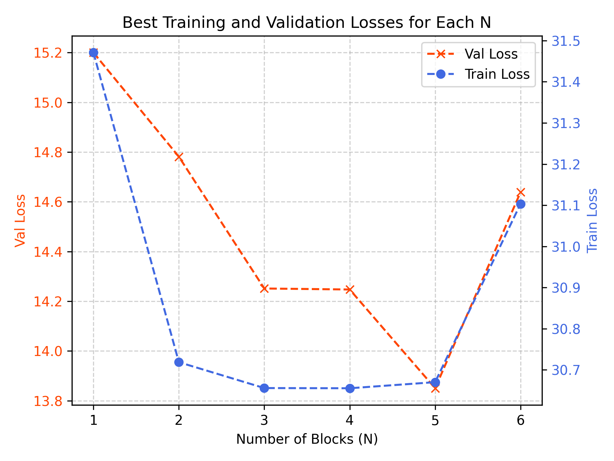
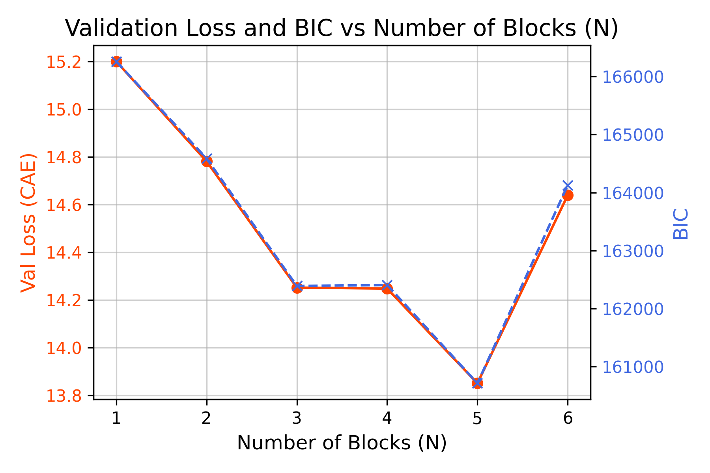

# Battery Degradation Prediction

This repository is a fork of [vb_eis](https://repo.ijs.si/e2pub/vb_eis/-/tree/main?ref_type=heads) which aims to find the optimal parameters and model complexity for battery degradation simulations.

This project explores battery degradation modelling using an equivalent circuit model with varying model complexity (number of RC blocks).

## Experiments Done

- **Leave-One-Cell-Out Cross-Validation** was performed to validate model generalisation across cells.
- 100 random seeds were tested for parameter initialisation to avoid local minima.
- Experiments were run at 10 Hz, downsampled to 2 kHz.
- The **Adam optimiser** was used with tailored learning rates per parameter group.
- **Cumulative Absolute Error (CAE)** served as the primary loss metric.

## Key Findings
- Two RC blocks already provide a good fit to the data, with diminishing improvements beyond that.
- BIC was not suitable as a model selection metric due to the large number of data points relative to model parameters.

<div style="display: flex; justify-content: space-around;">
    
    
    
</div>


More plots and figures from the experiments are available in the branch [plots](https://github.com/nsamelson/Battery-degradation/tree/plots/plots).

## Future Work

- Extend experiments to other frequency ranges to check if similar trends hold.
- Explore alternative loss functions (e.g. MSE, RMSE, MAPE) for better comparison across datasets with different sample sizes.
- Investigate model selection methods less sensitive to dataset size and better aligned with balancing complexity and accuracy.

## Code Architecture

1. `main.py` runs the model training. Arguments can be passed via the command line to configure experiments (run `python main.py --help` for information or refer directly to the script). The main function calls the following files:
    - `preprocess_data.py` handles sampling of random parameters and cleans the signal before training.
    - `train.py` contains the training loop.
    - `models.py` implements the optimiser, loss functions, and simulation logic.
    - `vb_eis/` contains code from the original [vb_eis repository](https://repo.ijs.si/e2pub/vb_eis/-/tree/main?ref_type=heads) to perform the simulations.
2. `plot_data.py` is used to generate plots for previously trained models.

## How to Run

1. Create an Apptainer image (for running on a cluster) or a virtual environment (for running locally):
    - **Apptainer**:  
      ```bash
      apptainer build <NAME_OF_IMAGE> jax_apptainer.bootstrap
      ```
    - **Virtual environment**:  
      ```bash
      python -m venv <NAME_OF_VENV>
      source <NAME_OF_VENV>/bin/activate
      ```
2. Ensure the required libraries are installed (see `requirements.txt`):
    - **Apptainer**: Add the necessary packages at the end of the file `jax_apptainer.bootstrap`.
    - **Virtual environment**:  
      ```bash
      pip install -r requirements.txt
      ```
3. Run the experiments:
    - **Apptainer**: Set up the arguments in `exec_experiments.sh` and execute with:  
      ```bash
      sbatch exec_experiments.sh
      ```
    - **Virtual environment**: Run directly, for example:  
      ```bash
      python main.py -n test -N 1 -i 1000 -f 10 -s 2000 -d -rs 10 -m -o adam -l CAE
      ```
